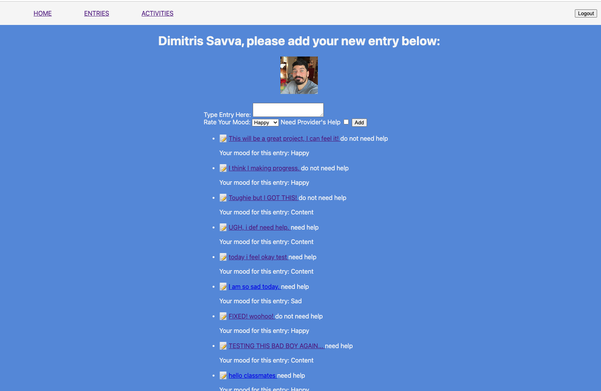

## [Use MindLog Here](https://therapy-app.fly.dev/)
MindLog is a therapy portal where a patient and provider (medical care provider) can communicate based on the entries and mood of the patient. Each patient's daily logs are only visible to their assigned psychologist/psychiatrist/medical care provider where they can be assessed for further treatment such as suggesting daily mood-boosting activities, medication, and more. 

The inspiration for this type of app comes from my daily digital mind log where I collect my thoughts and describe my mood, which I have shared verbatim during my therapy sessions over the years. My hope is that such an app can be easily accessible to anyone in order to better their mental health and even for suicide prevention. 

Planning materials and wireframes can be found [here](https://trello.com/b/CT0zC3vH/medical-chart-therapy-log)
## Technologies Used
* Express
* Node.js
* Mongoose
* MongoDB
* Google OAuth
* EJS
* JavaScript
* HTML
* CSS
* Git

## Credits
* All GA Instructors, TA's and classmates for their help.

## Ice Box
- [ ]  Loggin configuration between "providers" and "patients".
- [ ] Logged-in providers are able to view their assigned patients' entries and suggest mood-boosting activities, medication, etc.
- [ ] Add entry and activity sorting and search capability. 
- [ ] Better UI/UX implementation. 
- [ ] Open to references and suggestions.